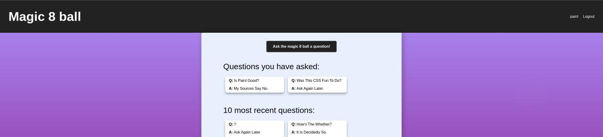

# Capstone 3 - Magic 8 ball

#### Live link: https://magic-8.vercel.app/  
#### Client repo: https://github.com/Aelof3/magic8ball  
#### Server repo: https://github.com/Aelof3/magic8ball-api  

___

___  
#### How to use:
* Create an account
* Login to your account
* View the questions recently asked by everyone
    

* Look over all the questions you have asked
* Click the button at the top to ask the magic 8 ball a question
* Ask the magic 8 ball a question
    
* The magic 8 ball will magically spin to show you the prophetic answer to your question!

___
#### Technologies used:
* Front end: React, HTML, CSS
* Back end: Node, Express
* Database: Postgresql
___

___
#### API endpoints:
* /api/user
    > **POST**  
    > request - username, password, name  
    > response - serialized user  
* /api/auth/token
    > **POST**  
    > request - username, password  
    > response - auth token  
    > **PUT**  
    > request - user id, user name  
    > response - token  

* /api/ask
    > **GET**  
    > request - no parameters  
    > response - array of questions  
* /api/ask/user/:user_id
    > **GET**  
    > request - user_id in url  
    > response - list of questions from user  
    > **POST**  
    > request - user_id in url, question in body  
    > response - answer_id  
* /api/ask/answers
    > **GET**  
    > request - no parameters  
    > response - list of the possible 8 ball answers  